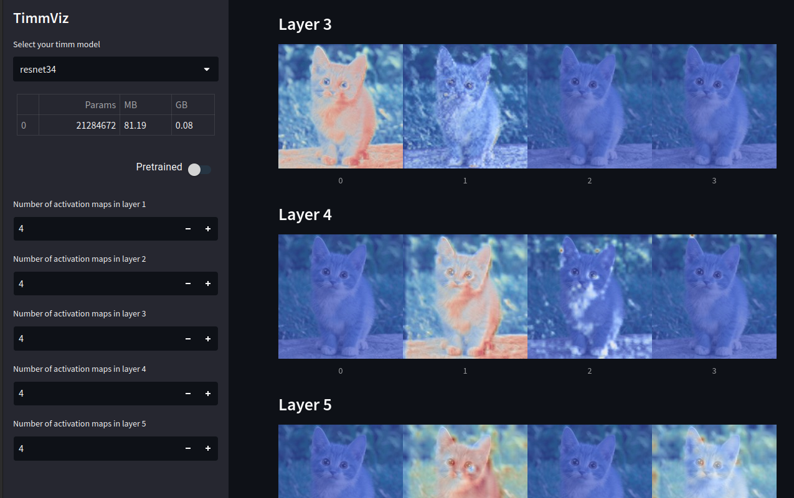

# TimmViz

Application which uses streamlit to show activation maps of timm models that implement features_only

### Requirements

`pip install streamlit numpy timm streamlit-toggle-switch Pillow opencv-python cmapy pandas`

### Run

`streamlit run timmviz.py`

### Screenshot

